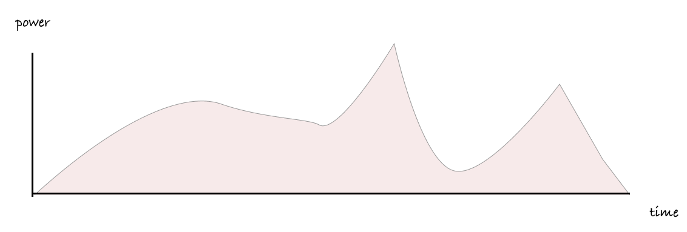
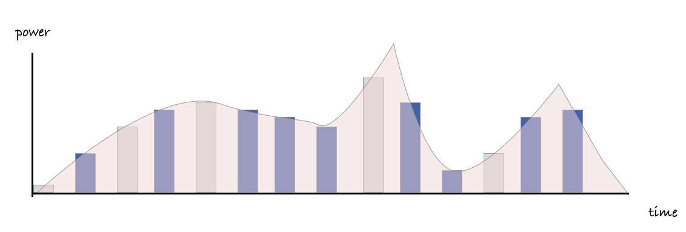
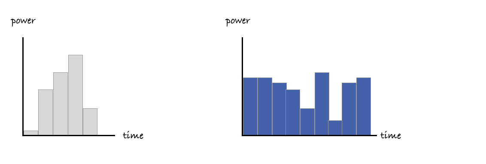

# How scaphandre computes per process power consumption

Scaphandre is a tool that makes it possible to see the power being used by a single process on a computer.

This sounds like a simple thing thing to be able to do, but it turns out to be surprisingly complicated. So having a good mental for how it works will make it understand when and how to use Scaphandre.
### How a computer works on multiple jobs at the same time

It's important to understand when we start out, our mental model for how much energy a single process might use might look like the figure below, with large, uninterrupted sessions for each process.

This is easy to understand, but the reality is somewhat different.

#### Timesharing of work

As we know computers work on lots of different jobs at the same time - they work on one job for short interval of time, then another, and another and so one. You'll often see these [small intervals of time referred to as [_jiffies_][].

[jiffies]: https://www.anshulpatel.in/post/linux_cpu_percentage/

In a given amount of time, certain jobs that are more important, or resource intensive will use more jiffies than others. Fortunately, each job keeps a running total of the total jiffies allocated to it, so if we know how many jiffies have been used in total, it can give us an idea how much of a machine's resources are being used by a given process.

### Going from share of resources to actual power figures

It's possible without Scaphandre to understand how large a share of a machines' resources are being used by a given process, but if we want to understand the power used per process, we need to know how much power is being used by the machine in absolute terms.

To do this, we need a sensor of some kind to track power usage by the machien itself. Some servers have these like with Intel's RAPL sensots,, making it possible to understand how much power is being used by CPUs, GPUs and so on.

If we combine all the intervals when our job is worked on, _and_ we know how much power is being drawn at those moments in time, we're in a better place.

We get an idea of how much power is being used by our job in total, in absolute terms, by looking at the power draw during all the moments our particular job is being worked on - that is, the power drawn for 'our' jiffies.

Finally once we have these, if group them together and add together the power used when 'our' jiffies are worked on, we can arrive at a useable figure.

As long are able to read from sensors that can share how much power is being used by a server at a given moment, and how much of the time  being allocated to our processes during those moments, we can calculate these figures.

This can work with virtualised environments, as long the guest virtual machine or guest container has access to readings provided by the host physical machine. Scaphandre supports exposing power info to virtual machines run using QEMU/KVM. (More on scaphandre in virtualised scenarios to come.).

----

As you can see with the [prometheus exporter reference](../references/exporter-prometheus.md), scaphandre exporters can provide process level power consumption metrics. This section will explain how it is done and how it may be improved in the future.
## Some details about RAPL

We'll talk here about the case where scaphandre is able to effectively measure the power consumption of the host (see [compatibility](../compatibility.md) section for more on sensors and their prerequesites) and specifically about the [PowercapRAPL](../references/sensor-powercap_rapl.md) sensor.

Let's clarify what's happening when you collect metrics with scaphandre and this sensor.
RAPL stands for [Running Average Power Limit](https://01.org/blogs/2014/running-average-power-limit-%E2%80%93-rapl). It's a technnology embedded in most Intel and AMD x86 CPUs produced afeter 2012. Thanks to this technology it is possible to get the total energy consumption of the CPU, of the consumption per CPU socket, plus in some cases, the consumption of the DRAM controller. In most cases it represents the vast majority of the energy consumption of the machine (except when running GPU intensive workloads, for example). Further improvements shall be made in scaphandre to fully measure the consumption when GPU are involved (or a lot of hard drives on the same host...).

Between scaphandre and those data is the powercap kernel module that writes the energy consumption in files. Scaphandre, reads those files, stores the data in buffer and then allows for more processing through the exporters.

## How to get the consumption of one process ?

The PowercapRAPL sensor does actually some more than just collecting those energy consumption metrics (and casting it in power consumption metrics). Every time the exporter asks for a measurement (either periodically like in the [Stdout](../references/exporter-stdout.md) exporter, or every time a request comes like for the Prometheus exporter) the sensor reads the values of the energy counters from powercap, stores those values and does the same for the CPU usage statistics of the CPU (the one you can see in `/proc/stats`) and for each running process on the machine at that time (see `/proc/PID/stats`). With those data it is possible to compute the ratio of CPU time actively spent for a given PID on the CPU time actively spent doing something. With this ratio we can then get the subset of power consumption that is related to that PID on a given timeframe (between two measurement requests).

## How to get the consumption of an application/a service ?

Services and programs are often not running only one PID. It's needed to aggregate the consumption of all related PIDs to know what this service is actually consuming. 

To do that, in the current state of scaphandre development, you can use the Prometheus exporter, and then use Prometheus TSDB and query language capabilities. You'll find examples looking at the graphs and queries [here](https://metrics.hubblo.org). In a near future, more advanced features may be implemented in scaphandre to allow such classification even if you don't have access to a proper TSDB.
