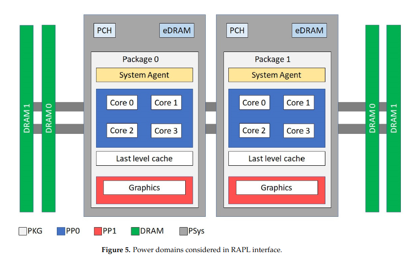

# Explanation on RAPL domains (what we know so far)

## PSYS

[Kepler documentation](https://sustainable-computing.io/design/metrics/) says PSYS "is the energy consumed by the "System on a chipt" (SOC)."
"Generally, this metric is the host energy consumption (from acpi)." but also "Generally, this metric is the **host energy consumption (from acpi) less the RAPL Package and DRAM**."

[https://zhenkai-zhang.github.io/papers/rapl.pdf](https://zhenkai-zhang.github.io/papers/rapl.pdf) says
Microarchitecture 	Package 	CORE (PP0) 	UNCORE (PP1) 	DRAM
Haswell 	Y/Y 	Y/N 	Y/N 	Y/Y
Broadwell 	Y/Y 	Y/N 	Y/N 	Y/Y
Skylake 	Y/Y 	Y/Y 	Y/N 	Y/Y
Kaby Lake 	Y/Y 	Y/Y 	Y/N 	Y/Y

[https://www.arcsi.fr/doc/platypus.pdf](https://www.arcsi.fr/doc/platypus.pdf) says PSYS is "covering the entire SoC.".

http://www.micheledellipaoli.com/documents/EnergyConsumptionAnalysis.pdf says
"PSys: (introduced with Intel Skylake) monitors and con-
trols the thermal and power specifications of the entire
SoC and it is useful especially when the source of the
power consumption is neither the CPU nor the GPU. For
multi-socket server systems, each socket reports its own
RAPL values."

https://hal.science/hal-03809858/document says
"PSys. Domain available on some Intel architectures, to monitor and control the thermal
and power specifications of the entire system on the chip (SoC), instead of just CPU or
GPU. It includes the power consumption of the package domain, System Agent, PCH,
eDRAM, and a few more domains on a single-socket SoC"

https://github.com/hubblo-org/scaphandre/issues/116
https://github.com/hubblo-org/scaphandre/issues/241
https://github.com/hubblo-org/scaphandre/issues/140
https://github.com/hubblo-org/scaphandre/issues/289
https://github.com/hubblo-org/scaphandre/issues/117
https://github.com/hubblo-org/scaphandre/issues/25
https://github.com/hubblo-org/scaphandre/issues/316
https://github.com/hubblo-org/scaphandre/issues/318

PSYS MSR is "MSR_PLATFORM_ENERGY_STATUS" 
https://copyprogramming.com/howto/perf-power-consumption-measure-how-does-it-work

https://pyjoules.readthedocs.io/en/stable/devices/intel_cpu.html

Problems of RAPL on Saphire Rapids
https://community.intel.com/t5/Software-Tuning-Performance/RAPL-quirks-on-Sapphire-Rapids/td-p/1446761

Misc info on RAPL
https://web.eece.maine.edu/~vweaver/projects/rapl/

PSYS MSR have a different layout than PKG and dram
https://patchwork.kernel.org/project/linux-pm/patch/20211207131734.2607104-1-rui.zhang@intel.com/

https://edc.intel.com/content/www/us/en/design/ipla/software-development-platforms/client/platforms/alder-lake-desktop/12th-generation-intel-core-processors-datasheet-volume-1-of-2/010/power-management/ ==> intel doc avout thermal and power management
https://edc.intel.com/content/www/us/en/design/ipla/software-development-platforms/client/platforms/alder-lake-desktop/12th-generation-intel-core-processors-datasheet-volume-1-of-2/002/platform-power-control/ ==> about psys

https://www.intel.com/content/www/us/en/developer/articles/technical/intel-sdm.html ==> intel software developer manual

CVE-8694/8695 and mitigation by intel
https://www.intel.com/content/www/us/en/developer/articles/technical/software-security-guidance/advisory-guidance/running-average-power-limit-energy-reporting.html

Patch in the kernel
https://groups.google.com/g/linux.kernel/c/x_7RbqcrxAs
Patch in powercap
https://lkml.iu.edu/hypermail/linux/kernel/1603.2/02415.html
https://lkml.kernel.org/lkml/1460930581-29748-1-git-send-email-srinivas.pandruvada@linux.intel.com/T/

Random
https://stackoverflow.com/questions/55956287/perf-power-consumption-measure-how-does-it-work