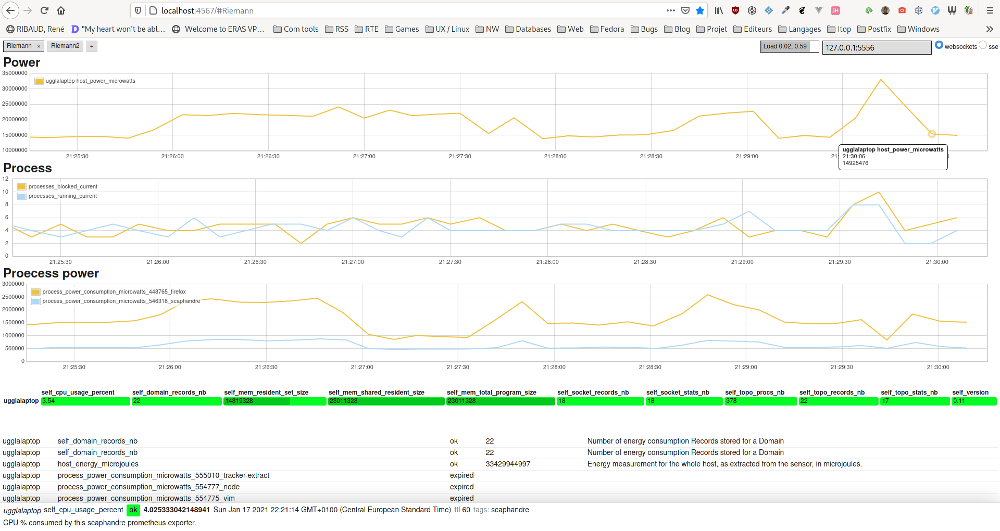

# Riemann exporter



## Usage

You can launch the Riemann exporter this way (running the default powercap_rapl sensor):

	scaphandre riemann

As always exporter's options can be displayed with `-h`:
```
scaphandre-riemann
Riemann exporter sends power consumption metrics to a Riemann server

USAGE:
    scaphandre riemann [FLAGS] [OPTIONS]

FLAGS:
    -h, --help       Prints help information
    -q, --qemu       Instruct that scaphandre is running on an hypervisor
    -V, --version    Prints version information

OPTIONS:
    -a, --address <address>               Riemann ipv6 or ipv4 address [default: localhost]
    -d, --dispatch <dispatch_duration>    Duration between metrics dispatch [default: 5]
    -p, --port <port>                     Riemann TCP port number [default: 5555]

```
With default options values, the metrics are sent to http://localhost:5555 every 5 seconds

Use -q or --qemu option if you are running scaphandre on a hypervisor. In that case a label with the vm name will be added to all `qemu-system*` processes.
This will allow to easily create charts consumption for each vm and defined which one is the top contributor.

## Metrics exposed

Typically the Riemann exporter is working in the same way as the prometheus exporter regarding metrics. Please look at details in [Prometheus exporter](exporter-prometheus.md) documentations.

There is only one exception about `process_power_consumption_microwatts` each process has a service name `process_power_consumption_microwatts_pid_exe`.

As an example, process consumption can be retrieved using the following Riemann query:
```
(service =~ "process_power_consumption_microwatts_%_firefox") or (service =~ "process_power_consumption_microwatts_%_scaphandre")
```
